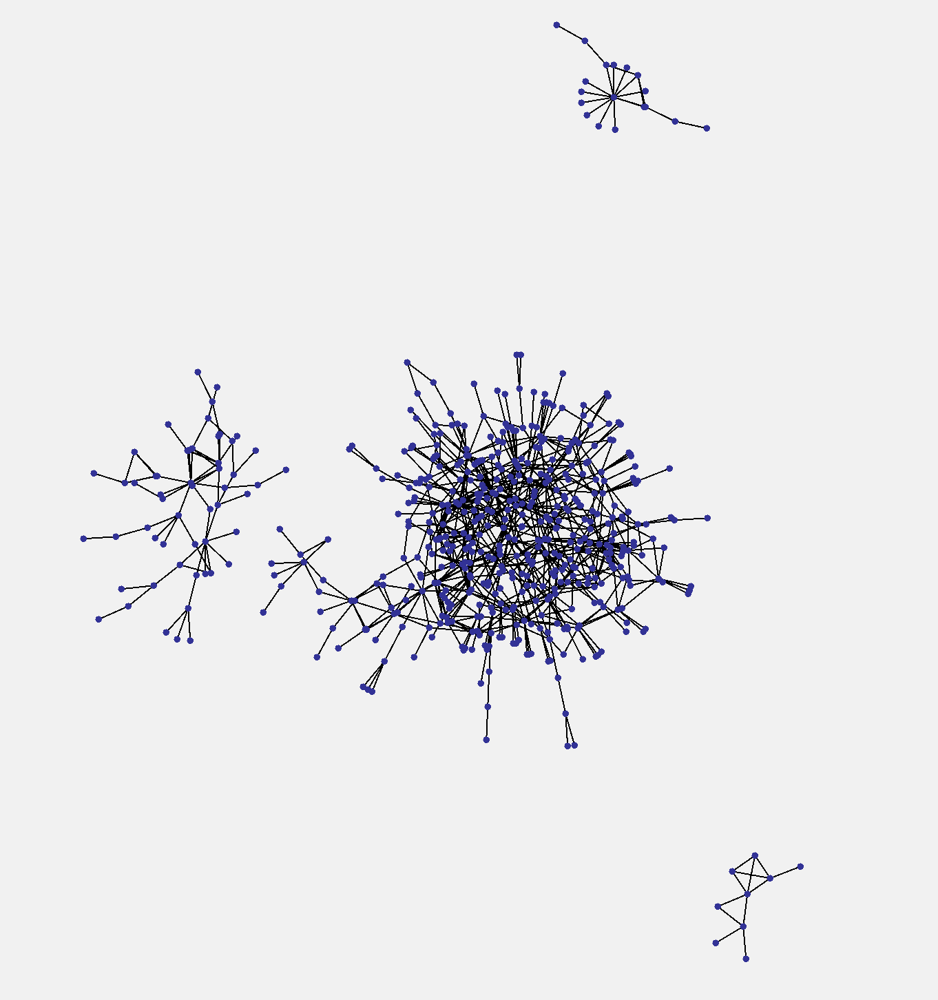

# CommunityDetect

## You can see the visualization result by build and run the Runtest.java.

## Overview

This project focuses on detecting the smaller communities from a large scale graph. Using GraphStream to visualize the separation of the graph, the correctness of detection can be verified.

## Data 

I used the UCSD Facebook data and the same data of smaller size. It comes from the paper "The Social Structure of Facebook Networks", by Amanda L. Traud, Peter J. Mucha, Mason A. Porter. I represent the data in the txt files to the graph class which is imported from the GraphStream jar. The data size is the same of the original txt file and smaller ones are of 1000 and 2000 vertices.

## Algorithms and Data Structures

Easy: Using BFS and other shortest path algorithm to find the edge with the maximum betweenness. And then repeat the process until the community is off a certain size. It uses queue or stack for the BFS, and even priority queue to improve the short path algorithm.

## Algorithm Analysis

The algorithm for the harder question is consisted of several different algorithm. First, the visualization can be either realized during and after the process of community separation. So let us consider the hardest mode of this algorithm. After every removal of a single edge, the graph visualization is updated once. So the removal process is gonna take O(|E|). And during every edge removal operation, using BFS, for all of the |V| vertices as source Node, it consumes approximately O(|V| (|V| +|E|)) times of operations. So the overall complexity will be no larger than cubic.

For large scope of data, I test the performance of the algorithm using the Facebook data. There is obviously a lag due to the visualization process and the scale of the graph. However, if you can open the final version of my project, and run the "Runtest.java", the visualization process is really cool.

The test data I use for the presentation has 730 vertices and 1512 edges, which is very large for a graph visualization. For smaller scale of graph, the detection can be completed instantaneously.

